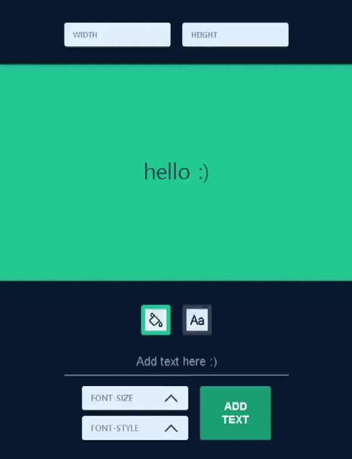
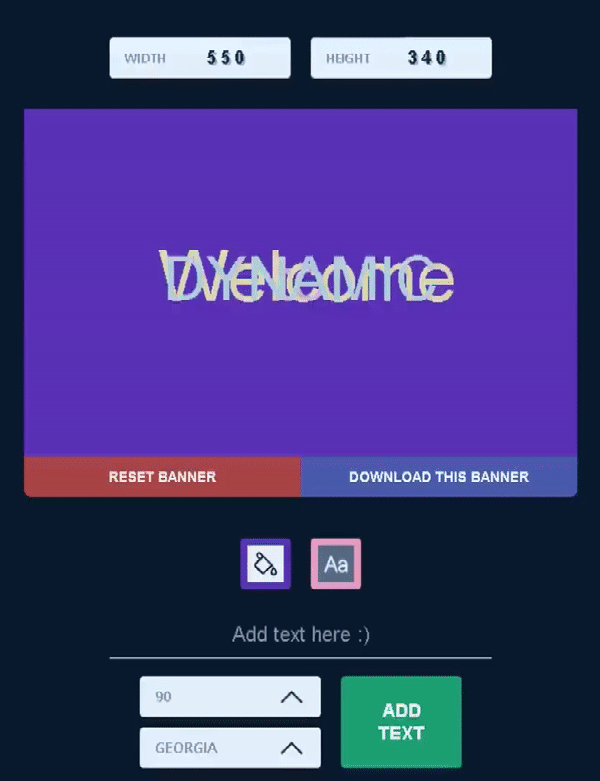
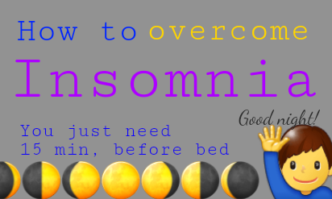

    <a href="https://jeremyoo.github.io/DynamicBanner/">
        <h1>Dynamic Banner</h1>
    </a>

Dynamic Banner allows you to create banners with various design quickly and easily!

[[Go to Dynamic Banner]](https://jeremyoo.github.io/DynamicBanner/)

 

## Features
- Create text element on canvas and download it as PNG image.
- Available design options:
    - font family
    - font & canvas size
    - font & canvas color
    - position of text element

## Exmaples

    
    
    

## Issue
Please submit any issue through following link [[Dynamic Banner Issue]](https://github.com/jeremyoo/DynamicBanner/issues).

## License
MIT
